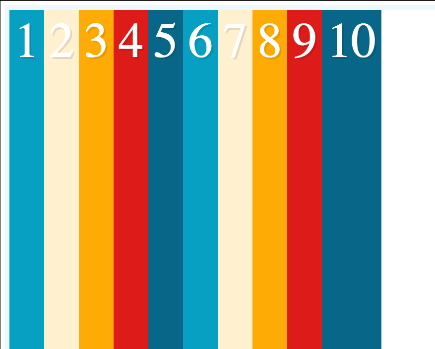
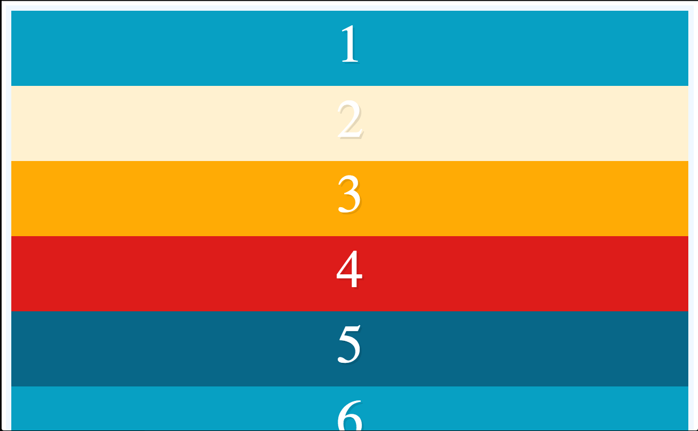
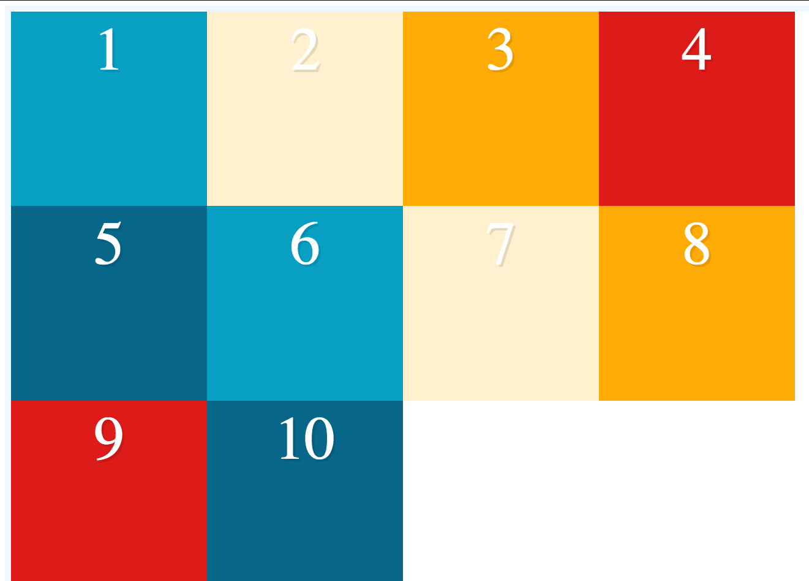

<h1>My Flexbox notes:</h1>

<h4>From CSS Tricks: "The main idea behind the flex layout is to give the container the ability to alter its items' width/height (and order) to best fill the available space (mostly to accommodate to all kind of display devices and screen sizes). Note: Flexbox layout is most appropriate to the components of an application, and small-scale layouts, while the Grid layout is intended for larger scale layouts." </h4>

1. Intro

    - Adding INLINE to -flex will wrap the flex container just around the content it needs, not the whole width of the page
    - All children of flex container become flex items automatically
    - vh extension: viewport height, so 100vh is 100% of the viewport height; kind of like height: 100%

2. Flex-direction

    - `flex-direction: row` is the default; rows stack next to each other and then expand vertically to fill specified height;
    
    - `flex-direction: column` does the opposite; elements stack on top of each other
    
    - important points:
        - there are two main axes (main and cross) depending on whether you've specified row or column
        - `flex-direction: row-reverse` causes main axis to run from right to left

3. Flex-wrap

    - default is `flex-wrap: nowrap;`
    - specified on flex container not flex item
    
    - padding and border are part of the box model whereas margin is not (need to learn more here)

4. Flexbox ordering

    - allows you to move DOM elements order without affecting the DOM
    - default: `order: 0`
        - if you set the order to anything greater than 0, it pops on the end
    - kind of like z-index; no order
    - if you highlight in the page, the flex items go in order, so don't use if text is going to be copied in the box

5. Justify Content

    - justify-content: how are items aligned along the main axis?
    - `justify-content: flex-start` is default
    
    - `justify-content: center`
    
    - `justify-content: space-between`
    
    - `justify-content: space-around` gives you space on the right and left as well